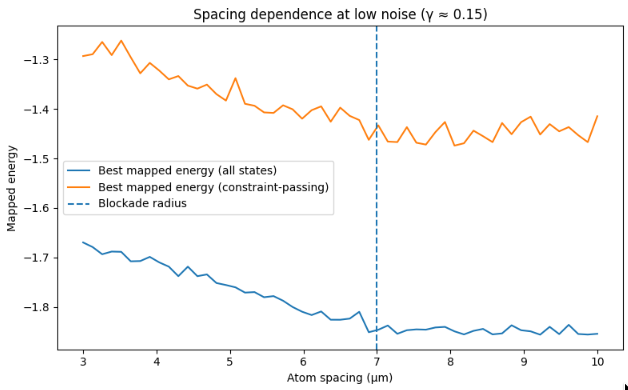

# neutral-atom-chemistry-lab

Mapping quantum chemistry workflows to neutral-atom hardware under realistic constraints.

**Key idea:** atom spacing relative to the blockade radius directly determines whether high-quality quantum chemistry solutions remain physically achievable.

---

## Overview

This repository demonstrates an end-to-end pipeline:

Chemistry Hamiltonian → Parameterized Circuit → Neutral-Atom Mapping → Noise Model → Validation 📐

The goal is not only to simulate quantum algorithms, but to identify **where they remain stable under hardware and noise constraints**.

---

## What this shows

- Below the blockade radius (~7 μm), geometry degrades achievable energy  
- Above the blockade radius, near-ground-state solutions become accessible  
- Constraint-based validation introduces a gap between optimal and physically valid solutions  

---

## Motivation

Many quantum algorithm demos stop at ideal simulation. Real hardware introduces:

- limited connectivity and geometry constraints  
- Rydberg blockade effects  
- noise and decoherence  

This repo adds a **validation step** to determine which configurations are physically viable.

---

## Core Components

- **Quantum chemistry baseline**
  - H₂ Hamiltonian (minimal example)
  - Variational Quantum Eigensolver (VQE)

- **Neutral-atom mapping**
  - simple layout + blockade-aware constraints
  - geometry-sensitive execution

- **Noise modeling**
  - amplitude / dephasing proxies
  - effective γ-based sweeps

- **Constraint-based validation**
  - overlap threshold: cosθ ≥ 1/√(1² + 1²) 📐
  - filters unstable execution regions

---

## Repository Structure
