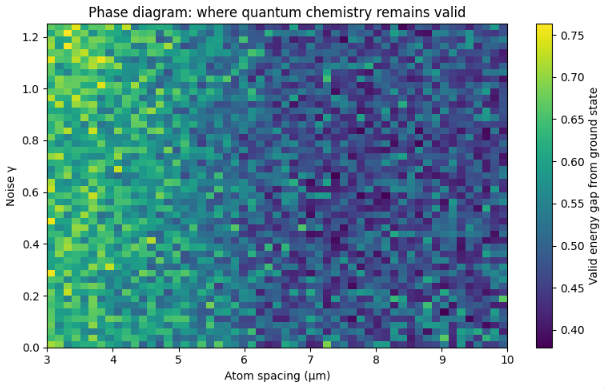

# neutral-atom-chemistry-lab

Mapping quantum chemistry workflows to neutral-atom hardware under realistic constraints.


**Key idea:** atom spacing relative to the blockade radius directly determines whether high-quality quantum chemistry solutions remain physically achievable.



*Phase diagram showing where quantum chemistry workflows remain both low-error and physically valid. The viable region shrinks as noise increases and as atom spacing enters the blockade regime.*

---

## Overview

This repository demonstrates an end-to-end pipeline:

Chemistry Hamiltonian → Parameterized Circuit → Neutral-Atom Mapping → Noise Model → Validation 📐

The goal is not only to simulate quantum algorithms, but to identify **where they remain stable under hardware and noise constraints**.

---

## What this shows

- Below the blockade radius (~7 μm), geometry degrades achievable energy  
- Above the blockade radius, near-ground-state solutions become accessible  
- Noise and geometry together define a bounded operating region  
- Constraint-based validation introduces a gap between optimal and physically valid solutions  

---

## Motivation

Many quantum algorithm demos stop at ideal simulation. Real hardware introduces:

- limited connectivity and geometry constraints  
- Rydberg blockade effects  
- noise and decoherence  

This repo adds a **validation step** to determine which configurations are physically viable.

---

## Core Components

- **Quantum chemistry baseline**
  - H₂ Hamiltonian (minimal example)
  - Variational Quantum Eigensolver (VQE)

- **Neutral-atom mapping**
  - simple layout + blockade-aware constraints
  - geometry-sensitive execution

- **Noise modeling**
  - amplitude / dephasing proxies
  - effective γ-based sweeps

- **Constraint-based validation**
  - overlap threshold: cosθ ≥ 1/√(1² + 1²) 📐
  - filters unstable execution regions

---

## Repository Structure

```text
notebooks/
  01_h2_vqe_neutral_atom.ipynb         # end-to-end demo (algorithm + noise + validation)
  02_blockade_mapping.ipynb            # geometry + blockade effects
  03_noise_geometry_phase_diagram.ipynb # noise–geometry operating map

src/neutral_atom_chemistry_lab/
  hamiltonians.py
  ansatz.py
  vqe.py
  mapping.py
  noise.py
  constraint_gate.py

examples/
  h2_minimal.py

docs/
  overview.md
```

---

## Quickstart

```bash
pip install -r requirements.txt
python examples/h2_minimal.py
```

Or open:

```text
notebooks/01_h2_vqe_neutral_atom.ipynb
```

---

## Notebook Highlights

### `01_h2_vqe_neutral_atom.ipynb`
A minimal H₂ VQE workflow with noise and validation. This notebook establishes the baseline algorithm-facing pipeline.

### `02_blockade_mapping.ipynb`
Adds geometry-aware mapping through atom spacing and blockade radius. This notebook shows how neutral-atom hardware constraints affect achievable energy.

### `03_noise_geometry_phase_diagram.ipynb`
Combines geometry, noise, and validation into a single operating-window view. This notebook shows where quantum chemistry workflows remain both low-error and physically valid.

---

## Why This Matters

Neutral-atom systems are promising for scalable quantum computing, but:

> Not all circuits that work in simulation are executable on hardware.

This repo focuses on:

- translating algorithms → hardware constraints  
- understanding noise-limited behavior  
- identifying stable operating regimes  

---

## Roadmap

- [ ] refine H₂ energy estimation (full expectation values)
- [ ] LiH extension
- [ ] improved Rydberg geometry modeling
- [ ] effective γ (γ + λγφ) noise model
- [ ] fault-tolerance bridge (logical vs physical qubits)

---

## Notes

This repository is intentionally minimal and application-focused.  
It is designed to be readable, reproducible, and directly relevant to neutral-atom quantum workflows.

---

## License

MIT (or add your preferred license)
